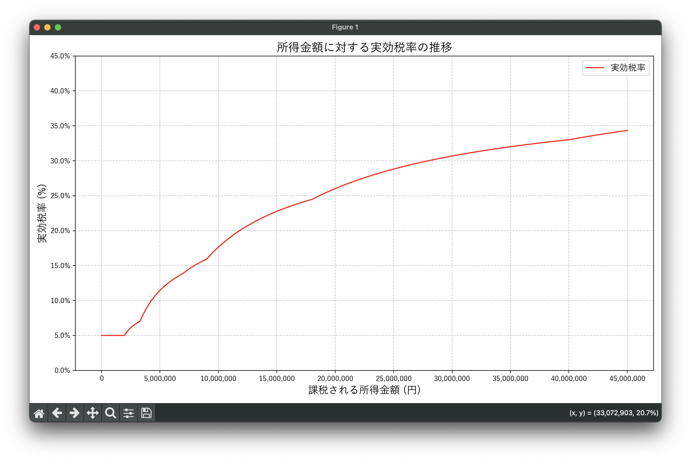

# 所得税実効税率グラフ

日本の所得税における実効税率をグラフで可視化するPythonプログラムです。

## 概要

このプログラムは、日本の所得税の速算表を使用して、課税所得金額に対する実効税率の推移をグラフで表示します。

## 機能

- 所得税の速算表に基づく税額計算
- 課税所得金額に対する実効税率の可視化
- 日本語フォントに対応したグラフ出力

## 必要なライブラリ

```
matplotlib
numpy
```

## インストール

```bash
pip install -r requirements.txt
```

## 使用方法

```bash
python graph.py
```

プログラムを実行すると、所得金額（1万円〜4500万円）に対する実効税率のグラフが表示されます。

## 税率区間

現在の所得税の税率区間：
- 195万円以下: 5%
- 195万円超330万円以下: 10%
- 330万円超695万円以下: 20%
- 695万円超900万円以下: 23%
- 900万円超1800万円以下: 33%
- 1800万円超4000万円以下: 40%
- 4000万円超: 45%

## 出力

プログラムを実行すると所得金額に対する実効税率のグラフが表示されます

